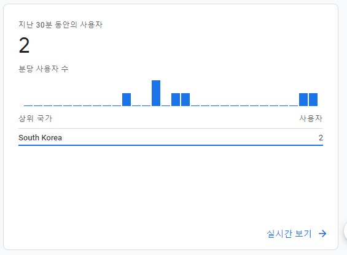

## Google Analytics란?

사이트로부터 받아지는 여러가지 데이터를 시각화하고 분석할 수 있는 구글의 서비스이다. 이 블로그는 Google Analytics 4를 사용하고 있다.

## 블로그에 적용하기

- 계정생성

  [구글 애널리틱스 사이트](https://analytics.google.com/analytics/web/#/p344369935/reports/intelligenthome)에 들어가서 계정을 생성하고 블로그에 사용할 측정 Id를 확인하여 \_config.yml에 붙여넣는다.

```
# Site settings
title: J.H blog
# baseurl: "/ap"
url: "https://github.com/jjunh33"
google_analytics: G-VXY5KFRLP5
```

- 만약 기본 ID가 UA-XXXXXXXX-X의 형식으로 된 경우

  이 경우 설치 스크립트를 따로 지정해줘야한다. 생성한 스트림을 선택하고 새로운 온페이지 태그 추가 탭의 코드를 복사하여 head.html 파일에 붙여넣는다.

```
<!-- Google tag (gtag.js) -->
<script async src="https://www.googletagmanager.com/gtag/js?id=G-VXY5KFRLP5"></script>
<script>
window.dataLayer = window.dataLayer || [];
function gtag(){dataLayer.push(arguments);}
gtag('js', new Date());

gtag('config', 'G-VXY5KFRLP5');
</script>
```

## 확인하기

제대로 적용되었다면 블로그에서 개발자 도구를 켜고

*gtag*를 입력했을 떄 _ƒ gtag(){dataLayer.push(arguments);}_ 문구가 뜨게 된다.

이후, 구글 애널리틱스 사이트에서 블로그 통계를 확인할 수 있다.


